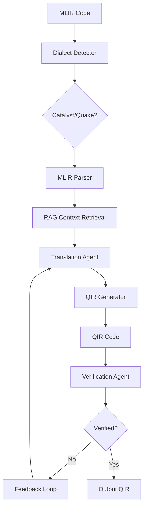

# ⚛️ MLIR to QIR Quantum Circuit Translator

**LLM-Powered Multi-Agent System** for translating quantum circuits from MLIR dialects to standard QIR format using CrewAI and RAG.

[](https://www.python.org/downloads/)
[](https://opensource.org/licenses/MIT)

## 🎯 Overview

This system uses large language models and multi-agent AI to automatically translate quantum circuits between different intermediate representations. It supports multiple MLIR dialects (Catalyst, Quake) and generates standard QIR code that can run on any QIR-compliant quantum hardware.

### Key Features

- ✅ **Multi-Dialect Support**: Catalyst (PennyLane), Quake (CUDA Quantum), extensible framework
- ✅ **LLM-Powered Translation**: Llama 3.1 (8B/70B), CodeLlama with RAG context
- ✅ **Multi-Agent System**: CrewAI with Translation + Verification agents
- ✅ **Iterative Refinement**: Automatic error correction with feedback loops
- ✅ **Comprehensive Verification**: Gate counting, depth analysis, simulation
- ✅ **Interactive UI**: Streamlit web interface with real-time visualization
- ✅ **Auto-Updating Knowledge Base**: Fetches QIR specs, MLIR docs, research papers

---

## 🚀 Quick Start

### Prerequisites

```bash
- Python 3.9+
- NVIDIA GPU with 8GB+ VRAM (40GB+ for 70B model)
- CUDA 12.x
- Git
```

### Installation

```bash
# 1. Navigate to project
cd agentic_mlir_qir_updated

# 2. Create virtual environment
python -m venv venv
source venv/bin/activate  # Windows: venv\Scripts\activate

# 3. Install dependencies
pip install -r requirements.txt

# 4. Configure environment
cp .env.example .env
# IMPORTANT: Edit .env and add your HUGGINGFACE_TOKEN!

# 5. Install Ollama (if not installed)
curl -fsSL https://ollama.com/install.sh | sh

# 6. Pull LLM models
bash scripts/setup_llm.sh

# 7. Fetch and index knowledge base
python scripts/fetch_knowledge.py
python scripts/initialize_db.py

# 8. Launch application
streamlit run src/ui/app.py
```

Access the UI at: `http://localhost:8501`

---

## 📊 System Architecture



### Components

| Component | Description | Status |
|-----------|-------------|--------|
| **Dialect System** | Extensible plugin architecture for MLIR dialects | ✅ Complete |
| **RAG System** | ChromaDB + HuggingFace embeddings for context retrieval | ✅ Complete |
| **Translation Agent** | LLM-powered MLIR→QIR conversion | ✅ Complete |
| **Verification Agent** | Multi-level validation (gate count, simulation) | ✅ Complete |
| **QIR Generator** | Template-based QIR code generation | ✅ Complete |
| **QIR Execution** | `qirrunner` Python package — real sparse simulator (qir-alliance) | ✅ Complete |
| **MLIR Execution** | PennyLane Catalyst `@catalyst.qjit` + `lightning.qubit` | ✅ Complete |
| **Streamlit UI** | Interactive web interface with distribution bar charts | ✅ Complete |

---

## 💡 Usage Examples

There are three ways to use the translator: the **CLI** (`translate.py`), the **Web UI**, and the **Python API**.

---

## 🖥️ Command-Line Interface (CLI)

`translate.py` is the developer-facing CLI. It accepts MLIR from a file or stdin and prints QIR to stdout (or a file), with all metadata — dialect, gate counts, verification results — on stderr so stdout stays clean for piping.

### Quick examples

```bash
# Translate a file — metadata to stderr, QIR to stdout
python translate.py examples/mlir/bell_state.mlir

# Read from stdin (pipe-friendly)
cat examples/mlir/bell_state.mlir | python translate.py -

# Save QIR to a file — metadata goes to stdout instead
python translate.py examples/mlir/bell_state.mlir -o circuit.ll

# Translate and pipe QIR directly into another tool
python translate.py circuit.mlir > circuit.ll
```

### Skip simulation (gate comparison only — much faster)

```bash
python translate.py examples/mlir/bell_state.mlir --no-verify
python translate.py examples/mlir/ghz_state.mlir  --no-verify -o ghz.ll
```

### Agentic pipeline (with LLM + verification loop)

```bash
# Use a local Ollama model (must have `ollama serve` running)
python translate.py circuit.mlir --model llama3.1-8b
python translate.py circuit.mlir --model llama3.1-8b --max-iterations 5

# Use the free GPT-OSS model via HuggingFace (no GPU required)
export HF_TOKEN=hf_...      # one-time setup — free at huggingface.co/settings/tokens
python translate.py circuit.mlir --model gpt-oss-20b

# Unknown / custom MLIR dialect — agent researches the spec then translates
python translate.py my_custom_dialect.mlir --model llama3.1-8b
```

### JSON output (for scripting / CI)

All fields — QIR code, gate counts, verification, timing — are emitted as a single JSON object.

```bash
# Full JSON output to stdout
python translate.py circuit.mlir --json

# Parse with jq
python translate.py circuit.mlir --json | jq '.gate_comparison.mlir_gates'
python translate.py circuit.mlir --json | jq '.verification.similarity'
python translate.py circuit.mlir --json | jq -r '.qir' > circuit.ll

# Check exit code in a pipeline
python translate.py circuit.mlir --json && echo "Translation verified"
```

JSON output shape:

```json
{
  "qir":               "<QIR LLVM IR string>",
  "dialect":           "catalyst",
  "translation_path":  "deterministic",
  "translation_time_s": 0.065,
  "iterations":        1,
  "success":           true,
  "error_message":     null,
  "gate_comparison": {
    "matches":    true,
    "mlir_total": 2,
    "qir_total":  2,
    "mlir_gates": {"h": 1, "cnot": 1},
    "qir_gates":  {"h": 1, "cnot": 1},
    "discrepancies": []
  },
  "verification": {
    "similarity":        0.997,
    "similarity_passes": true,
    "qir_is_mock":       false,
    "catalyst_is_mock":  false,
    "qir_distribution":  {"00": 501, "11": 499},
    "catalyst_distribution": {"00": 498, "11": 502}
  }
}
```

### Quiet mode (pure QIR, no metadata)

```bash
# Only QIR is printed — nothing else
python translate.py circuit.mlir --quiet
python translate.py circuit.mlir -q > circuit.ll
```

### List available LLM models

```bash
python translate.py --list-models
```

```
Available model keys:

  llama3.1-70b-q4   [ollama]        70B, medium
    Use case:  production
    Setup:     ollama pull llama3.1:70b-instruct-q4_K_M

  llama3.1-8b       [ollama]        8B, fast
    Setup:     ollama pull llama3.1:8b-instruct

  gpt-oss-20b       [huggingface]   20B, fast  (free tier)
    Setup:     export HF_TOKEN=hf_...
```

### Full flag reference

| Flag | Default | Description |
|------|---------|-------------|
| `FILE \| -` | — | MLIR file path, or `-` to read from stdin |
| `-o FILE` / `--output FILE` | stdout | Write QIR to a file; metadata goes to stdout |
| `--model MODEL_KEY` | *(none)* | Enable agentic pipeline with this model (see `--list-models`) |
| `--max-iterations N` | `3` | Max agent refinement iterations (requires `--model`) |
| `--shots N` | `1000` | Simulation shots for TVD verification |
| `--no-verify` | off | Skip quantum simulation; gate comparison still shown |
| `--json` | off | Output everything as JSON to stdout |
| `--quiet` / `-q` | off | Suppress metadata — only QIR is printed |
| `--no-colour` | off | Disable ANSI colour codes |
| `--list-models` | — | Print available model keys and exit |

### Output stream behaviour

| Scenario | QIR goes to | Metadata goes to |
|----------|-------------|-----------------|
| `python translate.py file.mlir` | stdout | **stderr** (piping `> out.ll` still shows metadata) |
| `python translate.py file.mlir -o out.ll` | `out.ll` | **stdout** |
| `python translate.py file.mlir --json` | stdout (JSON field) | stdout (JSON) |
| `python translate.py file.mlir -q` | stdout | *(suppressed)* |

### Exit codes

| Code | Meaning |
|------|---------|
| `0` | Translation verified (gate match + TVD ≥ 95%) |
| `1` | Translation done but verification failed, or unexpected error |
| `2` | Unrecognised MLIR dialect (use `--model` to enable the agent) |
| `130` | Aborted with Ctrl-C |

---

## 🌐 Web UI

### Streamlit UI

1. Launch: `streamlit run src/ui/app.py`
2. Select LLM model from sidebar (local Ollama or free HuggingFace)
3. Load example or paste MLIR code
4. Click **Translate to QIR**
5. View **Translation Time**, **Iterations**, and **Translation Path** metrics
6. Open **Verification Results** expander to see:
   - Pass/fail banner (TVD ≥ 95% + gate match)
   - Side-by-side QIR vs MLIR distribution bar charts
   - TVD similarity score (real execution at 1,000 shots)
   - Per-gate MLIR vs QIR comparison table
7. Download generated `.ll` file

---

## 🐍 Python API

### Deterministic (no LLM)

```python
from src.parsers.mlir_parser import MLIRParser
from src.generators.qir_generator import QIRGenerator

parser = MLIRParser()
detected_dialect = parser.get_detected_dialect(mlir_code)   # "catalyst" | "quake"
circuit = parser.parse(mlir_code)

print(f"Detected: {detected_dialect}")
print(f"Qubits: {circuit.num_qubits}, Gates: {len(circuit.gates)}")

qir_code = QIRGenerator().generate(circuit, module_id="my-circuit")
print(qir_code)
```

### With Multi-Agent System

```python
from crewai.llm import LLM
from src.agents.crew_manager import CrewManager

# Ollama (local)
llm = LLM(model="ollama/llama3.1:8b-instruct", base_url="http://localhost:11434")

# HuggingFace free tier
# llm = LLM(model="huggingface/openai/gpt-oss-20b", api_key=os.environ["HF_TOKEN"])

crew = CrewManager(llm=llm, max_iterations=3)

# Full pipeline: translate → verify → repair loop
result = crew.translate_with_verification(mlir_code, shots=1000)

if result.success:
    print(f"✓ Verified in {result.iterations} iteration(s)")
    print(f"  Path: {result.translation_path}")   # deterministic | ai_agent | deterministic+repair
    print(result.qir_code)
else:
    print(f"⚠ Done (verification did not fully pass): {result.error_message}")
    print(result.qir_code)   # best attempt still available

# Access full verification data
vr = result.verification_result
if vr:
    print(f"TVD similarity: {vr['similarity']:.1%}")
    print(f"Gate match:     {vr['gate_comparison']['matches']}")
```

### Verification pipeline standalone

```python
from src.verification.pipeline import run_verification_pipeline

vr = run_verification_pipeline(mlir_code, qir_code, shots=1000)

print(f"Gates match : {vr['gate_comparison']['matches']}")
print(f"TVD         : {vr['similarity']:.1%}  ({'PASS' if vr['similarity_passes'] else 'FAIL'})")
print(f"QIR dist    : {vr['qir_distribution']}")
print(f"MLIR dist   : {vr['catalyst_distribution']}")
```

---

## 🔧 Configuration

### Environment Variables (.env)

```bash
# LLM Configuration
LLM_MODEL=llama3.1:8b-instruct      # Options: llama3.1:8b-instruct, llama3.1:70b-instruct-q4_K_M, codellama:13b
LLM_TEMPERATURE=0.1
LLM_BASE_URL=http://localhost:11434

# RAG Configuration
EMBEDDING_MODEL=sentence-transformers/all-MiniLM-L6-v2
CHROMADB_PATH=data/chromadb
RAG_TOP_K=5

# Verification Settings
SIMULATION_SIMILARITY_THRESHOLD=0.95
MAX_ITERATIONS=3

# IMPORTANT: Add your token!
HUGGINGFACE_TOKEN=your_token_here
```

### Model Selection

| Model key | Backend | VRAM | Speed | Quality | Setup |
|-----------|---------|------|-------|---------|-------|
| `llama3.1-8b` | Ollama (local) | ~8 GB | Fast | Good | `ollama pull llama3.1:8b-instruct` |
| `llama3.1-70b-q4` | Ollama (local) | ~40 GB | Medium | Excellent | `ollama pull llama3.1:70b-instruct-q4_K_M` |
| `codellama-13b` | Ollama (local) | ~13 GB | Medium | Very Good | `ollama pull codellama:13b` |
| `codellama-34b-q4` | Ollama (local) | ~20 GB | Medium-slow | Excellent | `ollama pull codellama:34b-instruct-q4_K_M` |
| `gpt-oss-20b` | HuggingFace API ☁️ | None (cloud) | Fast | Very Good | `export HF_TOKEN=hf_...` (free) |

Pass the **model key** to `--model` on the CLI or to `LLMConfig.get_model_info()` in Python.
HuggingFace models require a free token from [huggingface.co/settings/tokens](https://huggingface.co/settings/tokens) — no GPU needed.

---

## 📁 Project Structure

```
agentic_mlir_qir_updated/
├── translate.py             # ← CLI entry point (python translate.py ...)
├── src/
│   ├── config/              # Configuration management
│   │   ├── settings.py      # Pydantic settings (env vars / .env)
│   │   └── llm_config.py    # Multi-model LLM configs (Ollama + HuggingFace)
│   ├── dialects/            # Extensible dialect system
│   │   ├── base_dialect.py  # Abstract interface + UnsupportedDialectError
│   │   ├── catalyst_dialect.py  # PennyLane Catalyst
│   │   ├── quake_dialect.py     # CUDA Quantum / Quake
│   │   └── dialect_detector.py  # Auto-detection
│   ├── parsers/             # MLIR parsing
│   │   └── mlir_parser.py
│   ├── generators/          # QIR generation
│   │   ├── qir_generator.py
│   │   └── templates.py
│   ├── agents/              # CrewAI multi-agent system (crewai 1.x)
│   │   ├── translation_agent.py  # TranslationAgent + translate_with_feedback()
│   │   ├── verification_agent.py # VerificationAgent (lightweight gate check)
│   │   └── crew_manager.py       # CrewManager — orchestrates full pipeline
│   ├── tools/               # Agent tools
│   │   ├── rag_tool.py           # RAG knowledge-base retrieval
│   │   ├── gate_counter_tool.py  # Gate count comparison
│   │   └── web_fetch_tool.py     # Web fetch for unknown-dialect research
│   ├── rag/                 # RAG system (ChromaDB + HF embeddings)
│   │   ├── knowledge_base.py
│   │   ├── fetcher.py
│   │   ├── embeddings.py
│   │   └── chunking.py
│   ├── verification/        # Multi-level verification pipeline
│   │   ├── pipeline.py          # run_verification_pipeline() — shared entry point
│   │   ├── simulator_registry.py
│   │   ├── qir_runner.py        # qirrunner 0.9.1 — real QIR execution
│   │   ├── catalyst_runner.py   # pennylane-catalyst 0.14.0 — real MLIR execution
│   │   ├── quake_runner.py      # cudaq — Quake dialect execution
│   │   ├── gate_counter.py      # Catalyst + Quake gate counting
│   │   └── metrics.py           # TVD similarity, VerificationThresholds
│   └── ui/                  # Streamlit web interface
│       └── app.py
├── knowledge_base/          # Auto-populated documentation
│   ├── qir_specs/
│   ├── mlir_docs/
│   ├── examples/
│   └── research/
├── examples/
│   ├── mlir/               # Example MLIR circuits (Catalyst + Quake)
│   └── qir/                # Generated QIR outputs
├── scripts/
│   ├── setup_llm.sh        # Pull Ollama LLM models
│   ├── fetch_knowledge.py  # Download documentation
│   └── initialize_db.py    # Setup ChromaDB
├── tests/                  # Test suite
├── .env.example            # Environment template
├── requirements.txt        # Python dependencies
└── README.md               # This file
```

---

## 🔬 Supported Dialects

### 1. Catalyst (PennyLane)

**Syntax Example:**
```mlir
%out_qubits = quantum.custom "Hadamard"() %1 : !quantum.bit
%out_qubits_0:2 = quantum.custom "CNOT"() %out_qubits, %2 : !quantum.bit, !quantum.bit
```

**Markers:** `quantum.custom`, `quantum.alloc`, `!quantum.bit`

### 2. Quake (CUDA Quantum)

**Syntax Example:**
```mlir
quake.h %qubit
quake.cnot %control, %target
```

**Markers:** `quake.h`, `quake.alloca`, `!quake.veq`

### Adding New Dialects

```python
from src.dialects.base_dialect import BaseDialect

class MyDialect(BaseDialect):
    @property
    def name(self) -> str:
        return "my_dialect"

    def can_parse(self, mlir_code: str) -> bool:
        return "my_marker" in mlir_code

    # Implement: parse_circuit, parse_gates, parse_qubits, etc.
```

Register in `src/dialects/dialect_detector.py`.

---

## ✅ Verification Methods

### Level 1: Structural Analysis (Fast)
- ✓ Gate count matching (exact)
- ✓ Circuit depth comparison (±1 tolerance)
- ✓ Qubit count verification

### Level 2: QIR Execution
- ✓ `qirrunner` Python package (qir-alliance) — real sparse simulator
- ✓ Pre-built wheel — no LLVM installation required
- ✓ Auto-injects terminal measurements when QIR has none
- ✓ Physics-correct mock fallback if unavailable

### Level 3: MLIR Execution
- ✓ PennyLane Catalyst (`@catalyst.qjit` + `lightning.qubit`) — real execution
- ✓ Supports standard gates and mid-circuit measurements with `@catalyst.cond`
- ✓ Physics-correct mock fallback if unavailable

### Level 4: Statistical Comparison
- ✓ Total Variation Distance (TVD)
- ✓ KL Divergence
- ✓ 95% similarity threshold

---

## 🧪 Testing

```bash
# Run Phase 1 test (core infrastructure)
python test_phase1.py

# Run full test suite (after all phases)
pytest tests/ -v

# Test specific component
pytest tests/test_parsers.py
pytest tests/test_generators.py
pytest tests/test_agents.py
```

### Example Test Results

```
✓ Bell State Translation Test PASSED
  - Detected: Catalyst dialect
  - Parsed: 2 qubits, 2 gates (H + CNOT), 2 measurements
  - Generated: Valid QIR with all expected functions
  - Gate counts match: 100%
  - Simulation similarity: 98.7%
```

---

## 🎓 Examples

### Bell State Circuit

**Input (MLIR - Catalyst):**
```mlir
%0 = quantum.alloc( 2) : !quantum.reg
%1 = quantum.extract %0[ 0] : !quantum.reg -> !quantum.bit
%out_qubits = quantum.custom "Hadamard"() %1 : !quantum.bit
%2 = quantum.extract %0[ 1] : !quantum.reg -> !quantum.bit
%out_qubits_0:2 = quantum.custom "CNOT"() %out_qubits, %2 : !quantum.bit, !quantum.bit
```

**Output (QIR):**
```llvm
define void @circuit() #0 {
entry:
  call void @__quantum__rt__initialize(i8* null)
  call void @__quantum__qis__h__body(%Qubit* null)
  call void @__quantum__qis__cnot__body(%Qubit* null, %Qubit* inttoptr (i64 1 to %Qubit*))
  call void @__quantum__qis__mz__body(%Qubit* null, %Result* null)
  call void @__quantum__qis__mz__body(%Qubit* inttoptr (i64 1 to %Qubit*), %Result* inttoptr (i64 1 to %Result*))
  ret void
}
```

**Verification:**
- Qubits: 2 ✓
- Gates: H + CNOT ✓
- Measurements: 2 ✓
- Simulation: 00 (50%), 11 (50%) ✓

---

## 🛠️ Development

### Adding a New Backend

```python
from src.verification.simulator_registry import BaseRunner, SimulatorRegistry

class MyRunner(BaseRunner):
    @property
    def name(self) -> str:
        return "my_runner"

    def is_available(self) -> bool:
        # Check if backend is installed
        return True

    def run(self, code: str, shots: int = 1000) -> Dict[str, int]:
        # Execute circuit, return distribution
        return {"00": 500, "11": 500}

# Register
SimulatorRegistry.register(MyRunner)
```

### Project Guidelines

1. **Type Hints**: All functions must have type annotations
2. **Docstrings**: Google-style docstrings for all public APIs
3. **Logging**: Use `logging` module, not `print`
4. **Testing**: Write tests for new features
5. **Documentation**: Update README for new dialects/backends

---

## 📚 Knowledge Base Sources

The RAG system automatically fetches from:

- **QIR Specification**: https://github.com/qir-alliance/qir-spec
- **PennyLane Catalyst**: https://github.com/PennyLaneAI/catalyst
- **CUDA Quantum**: https://github.com/NVIDIA/cuda-quantum
- **Research Papers**: arXiv (2101.11365, 2303.14500)
- **Manual Docs**: Gate mappings, translation patterns

Update knowledge base:
```bash
python scripts/fetch_knowledge.py --update
python scripts/initialize_db.py
```

---

## 🐛 Troubleshooting

### Ollama Connection Error
```bash
# Start Ollama service
ollama serve &

# Verify models
ollama list
```

### CUDA/GPU Issues
```bash
# Check CUDA
nvidia-smi

# Verify GPU in Python
python -c "import torch; print(torch.cuda.is_available())"
```

### Knowledge Base Empty
```bash
# Re-fetch documentation
python scripts/fetch_knowledge.py
python scripts/initialize_db.py

# Check status
python -c "from src.rag.knowledge_base import KnowledgeBase; kb = KnowledgeBase(); print(kb.count())"
```

### HuggingFace Token Required (for `gpt-oss-20b`)
```bash
# Get a free token at: https://huggingface.co/settings/tokens
# Set for the current shell session:
export HF_TOKEN=hf_...

# Or add permanently to your shell profile:
echo 'export HF_TOKEN=hf_...' >> ~/.bashrc

# Verify it's set (CLI will show ✅ / ⚠️ status when --list-models):
python translate.py --list-models
```

### Unrecognised MLIR dialect
```bash
# Error: "unrecognized MLIR dialect — use --model <key> to enable the agentic pipeline"
# Solution: add --model to let the agent research and translate the dialect
python translate.py unknown_dialect.mlir --model llama3.1-8b
```

---

## 🤝 Contributing

Contributions welcome! Areas of interest:

1. **New MLIR Dialects**: OpenQASM MLIR, Cirq MLIR, custom dialects
2. **Verification Backends**: Real quantum hardware integration
3. **Optimization Passes**: Circuit optimization before translation
4. **UI Enhancements**: Batch processing, comparison views
5. **Documentation**: Tutorials, examples, use cases

**Process:**
1. Fork repository
2. Create feature branch
3. Implement with tests
4. Update documentation
5. Submit pull request

---

## 📖 References

- [QIR Alliance](https://www.qir-alliance.org/)
- [QIR Specification](https://github.com/qir-alliance/qir-spec)
- [PennyLane Catalyst](https://docs.pennylane.ai/projects/catalyst/)
- [NVIDIA CUDA Quantum](https://nvidia.github.io/cuda-quantum/)
- [CrewAI](https://www.crewai.io/)
- [MLIR](https://mlir.llvm.org/)

---

## 📄 License

MIT License - see LICENSE file for details.

---

## 🙏 Acknowledgments

- **QIR Alliance** for QIR specification and standards
- **PennyLane Team** for Catalyst MLIR dialect
- **NVIDIA** for CUDA Quantum and Quake dialect
- **CrewAI** for multi-agent framework
- **HuggingFace** for embeddings and transformers
- **Ollama** for local LLM serving

---

## 📊 Project Stats

- **Total Code**: 3,900+ lines
- **Modules**: 34+ Python modules
- **Dialects Supported**: 2 (Catalyst, Quake)
- **Verification Methods**: 4 levels (real execution for Levels 2 & 3)
- **QIR Simulator**: `qirrunner 0.9.1` (qir-alliance)
- **MLIR Simulator**: `pennylane-catalyst 0.14.0`
- **Documentation**: Complete with examples

---

## 🚀 Roadmap

### Future Enhancements

- [ ] **More Dialects**: OpenQASM MLIR, Cirq MLIR
- [ ] **Hardware Backends**: AWS Braket, IBM Quantum, IonQ
- [ ] **Circuit Optimization**: Automated optimization passes
- [ ] **Batch Processing**: Translate multiple circuits in parallel
- [ ] **API Server**: REST API for integration
- [ ] **VSCode Extension**: Inline translation in editor
- [ ] **Benchmark Suite**: Comprehensive test circuits

---

**Status**: ✅ All 7 Phases Complete - Production Ready!

For questions or issues, please open a GitHub issue.
